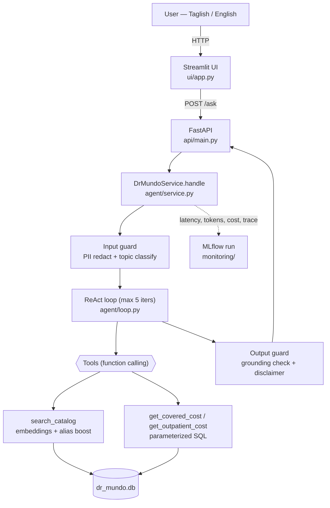

# Dr. Mundo 🩺

**An agentic AI cost estimator for Philippine healthcare.** Ask, in plain English or
Taglish, what a medical procedure or outpatient service costs. Dr. Mundo routes the
question, looks up **real numbers from a local SQLite database**, and returns a grounded
estimate. It never invents figures and never gives medical advice.

- **Path A — covered procedures** (a PhilHealth case rate applies): reports the hospital
  price **range**, the PhilHealth **case rate**, and the estimated **out-of-pocket (OOP)**.
- **Path B — outpatient services** (not PhilHealth-covered): reports the price **range
  only**, and states clearly that it is **not covered** (never computes OOP).

Example questions: *"Magkano ang appendectomy sa Chong Hua?"* · *"How much is a normal
delivery?"* · *"CT scan with contrast price"*.

---

## What makes the answers trustworthy

Six hard rules the system never breaks:

1. **No text-to-SQL.** The LLM never writes SQL — it only chooses *which* pre-written,
   parameterized query to call ([`db/queries.py`](db/queries.py)) and with what arguments.
2. **No invented numbers.** Every figure comes from a DB row. Enforced twice: the structured
   `Answer` fields are filled from tool observations (not model prose), and the output guard
   re-renders the prose from grounded fields if any peso amount can't be matched.
3. **No HMO / private insurance**, **no PhilHealth policy/eligibility Q&A**, and **no
   document vector store** (embeddings match the *catalog* only).
4. **No live external lookups** at answer time — all data is local CSVs / SQLite.
5. **No medical advice** — clinical/diagnostic/treatment questions get a polite refusal.

---

## Architecture



The numbers in the final `Answer` are filled from tool observations (the "grounding"), not
from the model's prose — so figures can never be hallucinated. The model only writes the
natural-language explanation, which the output guard cross-checks.

---

## Quick start (local)

Requires Python 3.11+. From the repo root:

```bash
python -m pip install -r requirements.txt

# 1. Build the SQLite DB from the committed CSVs (no API key needed).
python data/load_db.py                 # writes dr_mundo.db (gitignored)

# 2. Configure your key (used for chat, the input classifier, and query embeddings).
cp .env.example .env                   # then edit .env and set OPENAI_API_KEY

# 3. Run the two processes (separate terminals):
uvicorn api.main:app --reload          # API   → http://localhost:8000/docs
streamlit run ui/app.py                # UI    → http://localhost:8501

# 4. Tests (28 core + monitoring + eval unit tests; no API calls):
python -m pytest -q
```

`.env` keys (see [`.env.example`](.env.example)): `OPENAI_API_KEY` (required),
`OPENAI_CHAT_MODEL` (default `gpt-4o-mini`), `OPENAI_EMBEDDING_MODEL` (default
`text-embedding-3-small`). The UI reads `DR_MUNDO_API_URL` (default `http://localhost:8000`).

> `data/embeddings.npz` is **committed**, so you do not need to rebuild embeddings.
> Only run `python data/build_embeddings.py` (needs a key) if the catalog changes.

---

## Run with Docker

One command brings up both the API and the UI:

```bash
# OPENAI_API_KEY is read from your .env and injected at runtime only.
docker compose up --build
#   API → http://localhost:8000/docs
#   UI  → http://localhost:8501
```

The image is multi-stage (`python:3.11-slim`) and builds the SQLite DB at build time from
the committed CSVs — no key is needed to build, only to run. `docker-compose.yml` runs two
services (`api`, `ui`) on a shared network; the UI reaches the API at `http://api:8000`.

Single container (both processes) instead of compose:

```bash
docker build -t dr-mundo .
docker run --rm -e OPENAI_API_KEY=sk-... -p 8000:8000 -p 8501:8501 dr-mundo
```

---

## Monitoring (MLflow)

Every `/ask` logs one MLflow run — latency, token usage + estimated cost, the tool-call
trace, prompt version, and grounding/error status — via a transparent wrapper around the
OpenAI client ([`monitoring/`](monitoring/)). Logging is additive and never changes an
answer; disable it with `DR_MUNDO_MLFLOW=0`.

View the runs (the app logs to a local SQLite backend):

```bash
mlflow ui --backend-store-uri sqlite:///mlflow.db      # → http://localhost:5000
```

---

## Eval harness

An offline harness ([`eval/`](eval/)) drives 35 DB-grounded cases through
`DrMundoService.handle` and scores catalog match, path routing (A vs B), coverage/OOP
correctness, refusal + clarification correctness, latency, and token cost. It also runs a
**prompt-variant ablation** across `system_v1` / `system_v2` / `system_v3`.

```bash
python -m eval.run_eval                 # baseline prompt (system_v1)
python -m eval.run_eval --ablation      # compare v1 / v2 / v3 side by side
python -m eval.run_eval --limit 5       # quick subset while iterating
```

---

## Data model

Four tables in `dr_mundo.db` (schema in [`data/load_db.py`](data/load_db.py)):

| Table | Rows | Purpose |
|---|---|---|
| `hospitals` | 5 | id, hospital, city |
| `philhealth_procedure_rates` | 4,312 | the full Annex B catalog: `rvs_code`, `procedure`, `case_rate` |
| `hospital_procedure_prices` | 34 | **Path A** hospital prices; only **10** covered procedures are actually priced |
| `hospital_prices` | 100 | **Path B**: **47 distinct outpatient services** (CT, MRI, labs, checkups…) |

**OOP rules** (`_compute_oop`): case rate ≥ price high → fully covered (OOP 0); case rate ≥
price low → OOP `0 … high − case_rate`; else → OOP `low − case_rate … high − case_rate`.

---

## Module ownership

| Module | Responsibility |
|---|---|
| [`config.py`](config.py) | Paths, model names, cached (usage-tracked) OpenAI client, UTF-8 stdout fix |
| [`data/load_db.py`](data/load_db.py) | Build `dr_mundo.db` from the 4 CSVs (explicit schema, FKs, indexes) |
| [`data/build_embeddings.py`](data/build_embeddings.py) | Embed the catalog → `embeddings.npz` (L2-normalized) |
| [`db/queries.py`](db/queries.py) | **All** parameterized SQL: covered / outpatient cost, hospital resolution, OOP |
| [`db/search.py`](db/search.py) | Hybrid catalog search: cosine similarity + curated alias boost |
| [`db/aliases.py`](db/aliases.py) | Taglish aliases + `SERVICE_EQUIVALENTS` for cross-hospital grouping |
| [`agent/schemas.py`](agent/schemas.py) | Pydantic tool-arg models + the structured `Answer` |
| [`agent/tools.py`](agent/tools.py) | 5 OpenAI function schemas + validated dispatch registry |
| [`agent/loop.py`](agent/loop.py) | ReAct loop, richest-grounding tracking, `Answer` assembly |
| [`agent/memory.py`](agent/memory.py) | FIFO `SessionMemory` (8 turns, text only) |
| [`agent/format.py`](agent/format.py) | Deterministic grounded renderer (guard fallback) + disclaimer |
| [`agent/service.py`](agent/service.py) | Orchestrator: input guard → loop → output guard; usage + MLflow logging |
| [`agent/prompts/`](agent/prompts/) | Versioned system prompts (`system_v1/2/3`) for ablation |
| [`guardrails/`](guardrails/) | PII redaction, input topic classifier, output grounding guard |
| [`api/main.py`](api/main.py) | FastAPI: `POST /ask`, `GET /health`, `POST /reset`, `/docs` |
| [`ui/app.py`](ui/app.py) | Streamlit chat client (breakdown panel + collapsible trace) |
| [`monitoring/`](monitoring/) | Token/cost accounting + one MLflow run per request (Phase 9a) |
| [`eval/`](eval/) | Offline eval harness + prompt-variant ablation (Phase 9b) |
| [`tests/`](tests/) | Unit tests (aliases, queries, guardrails, monitoring, eval scoring) |

---

## Note for graders: is this RAG?

Yes — but deliberately **not** a document vector store. Retrieval here is semantic search
over the **procedure/service catalog**: the user's phrase is embedded and matched (with a
curated alias boost) against pre-embedded catalog names ([`db/search.py`](db/search.py)).
The retrieved catalog key then drives **parameterized SQL** that fetches the grounded price
rows ([`db/queries.py`](db/queries.py)), which are what the answer is generated from. So it
is retrieval-augmented generation — embeddings retrieve, the DB grounds, the model
explains — while satisfying the assignment's constraint of *no document vector store* and
*no invented numbers*.

---

## PhilHealth procedure case rates (data build)

[`scraper/scrape_case_rates.py`](scraper/scrape_case_rates.py) was a one-time build step: it
extracts the RVS code, procedure description, and case rate from PhilHealth's "Annex B —
List of Procedure Case Rates" PDF into
[`data/procedure_case_rates.csv`](data/procedure_case_rates.csv).

```bash
pip install -r scraper/requirements.txt
python scraper/scrape_case_rates.py --input /path/to/AnnexB-ListofProcedureCaseRates.pdf
```

This writes `data/procedure_case_rates.csv` with columns:

- `rvs_code` — RVS/procedure code as printed in the PDF (some are alphanumeric package codes,
  e.g. `MCP01`, and a few chemotherapy codes carry footnote asterisks, e.g. `96408*`)
- `procedure` — procedure description, unwrapped to a single line
- `case_rate` — case rate as a plain decimal number (commas removed)

Health Facility Fee and Professional Fee columns from the source PDF are intentionally
omitted.
